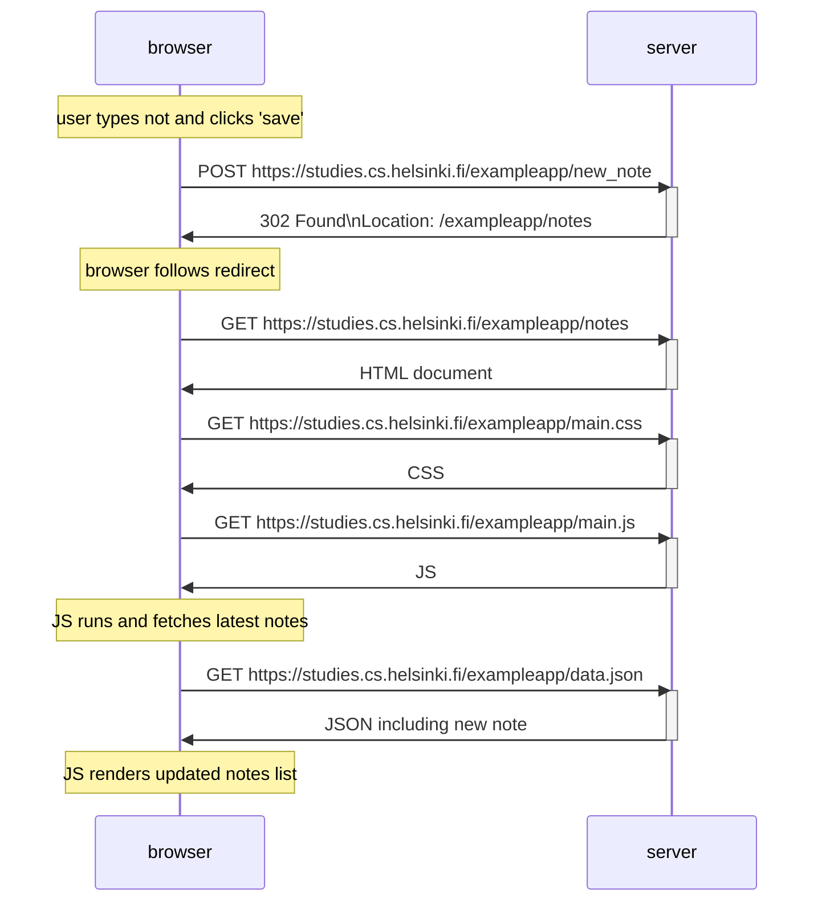

```mermaid
sequenceDiagram
participant browser
participant server

    Note over browser: user types not and clicks 'save'

    browser->>server: POST https://studies.cs.helsinki.fi/exampleapp/new_note
    activate server
    server->>browser: 302 Found\nLocation: /exampleapp/notes
    deactivate server

    Note over browser: browser follows redirect

    browser->>server: GET https://studies.cs.helsinki.fi/exampleapp/notes
    activate server
    server->>browser: HTML document
    deactivate server

    browser->>server: GET https://studies.cs.helsinki.fi/exampleapp/main.css
    activate server
    server->>browser: CSS
    deactivate server

    browser->>server: GET https://studies.cs.helsinki.fi/exampleapp/main.js
    activate server
    server->>browser: JS
    deactivate server

    Note over browser: JS runs and fetches latest notes

    browser->>server: GET https://studies.cs.helsinki.fi/exampleapp/data.json
    activate server
    server->>browser: JSON including new note
    deactivate server

    Note over browser: JS renders updated notes list
```
